# SIP Protocol Architecture

> Visual documentation of SIP Protocol architecture and flows

---

## Table of Contents

1. [System Architecture](#system-architecture)
2. [Transaction Flows](#transaction-flows)
3. [Cryptographic Flows](#cryptographic-flows)
4. [Privacy Comparison](#privacy-comparison)
5. [Integration Architecture](#integration-architecture)

---

## System Architecture

### High-Level Overview

```
┌─────────────────────────────────────────────────────────────────┐
│                      APPLICATION LAYER                          │
│  ┌─────────────┐  ┌─────────────┐  ┌─────────────┐              │
│  │   DApps     │  │   Wallets   │  │    DAOs     │              │
│  └──────┬──────┘  └──────┬──────┘  └──────┬──────┘              │
│         │                │                │                      │
│         └────────────────┼────────────────┘                      │
│                          ▼                                       │
│  ┌───────────────────────────────────────────────────────────┐  │
│  │                    @sip-protocol/sdk                       │  │
│  │  ┌─────────┐ ┌─────────┐ ┌─────────┐ ┌─────────────────┐  │  │
│  │  │ Intent  │ │ Stealth │ │ Privacy │ │ Wallet Adapters │  │  │
│  │  │ Builder │ │ Address │ │ Manager │ │ (ETH/SOL/NEAR)  │  │  │
│  │  └─────────┘ └─────────┘ └─────────┘ └─────────────────┘  │  │
│  └───────────────────────────────────────────────────────────┘  │
│                          │                                       │
├──────────────────────────┼───────────────────────────────────────┤
│                   PRIVACY LAYER (SIP)                            │
│  ┌───────────────────────┴───────────────────────────────────┐  │
│  │  ┌──────────────┐  ┌──────────────┐  ┌──────────────────┐ │  │
│  │  │   Pedersen   │  │   Stealth    │  │   Viewing Keys   │ │  │
│  │  │ Commitments  │  │  Addresses   │  │  (Compliance)    │ │  │
│  │  └──────────────┘  └──────────────┘  └──────────────────┘ │  │
│  │  ┌──────────────┐  ┌──────────────┐  ┌──────────────────┐ │  │
│  │  │   Funding    │  │   Validity   │  │   Fulfillment    │ │  │
│  │  │    Proof     │  │    Proof     │  │     Proof        │ │  │
│  │  └──────────────┘  └──────────────┘  └──────────────────┘ │  │
│  └───────────────────────────────────────────────────────────┘  │
│                          │                                       │
├──────────────────────────┼───────────────────────────────────────┤
│                   SETTLEMENT LAYER                               │
│  ┌───────────────────────┴───────────────────────────────────┐  │
│  │              NEAR Intents + Chain Signatures               │  │
│  │  ┌──────────────┐  ┌──────────────┐  ┌──────────────────┐ │  │
│  │  │  1Click API  │  │   Solvers    │  │ Chain Signatures │ │  │
│  │  └──────────────┘  └──────────────┘  └──────────────────┘ │  │
│  └───────────────────────────────────────────────────────────┘  │
│                          │                                       │
├──────────────────────────┼───────────────────────────────────────┤
│                    BLOCKCHAIN LAYER                              │
│  ┌────────┐  ┌────────┐  ┌────────┐  ┌────────┐  ┌────────┐    │
│  │  NEAR  │  │  ETH   │  │ Solana │  │ Zcash  │  │Bitcoin │    │
│  └────────┘  └────────┘  └────────┘  └────────┘  └────────┘    │
└─────────────────────────────────────────────────────────────────┘
```

### SDK Internal Structure

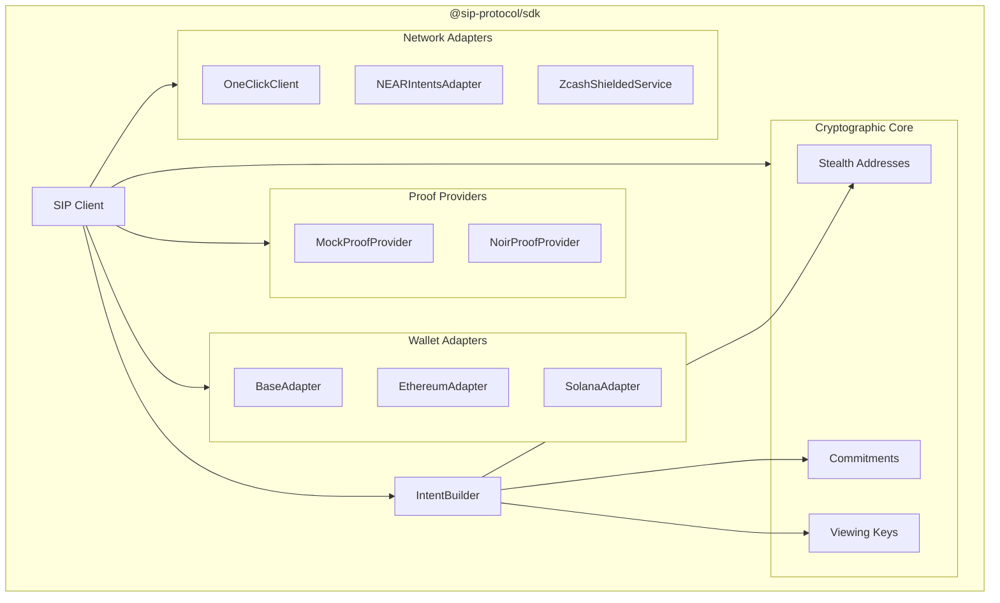

---

## Transaction Flows

### Transparent Flow

Standard cross-chain swap without privacy features.

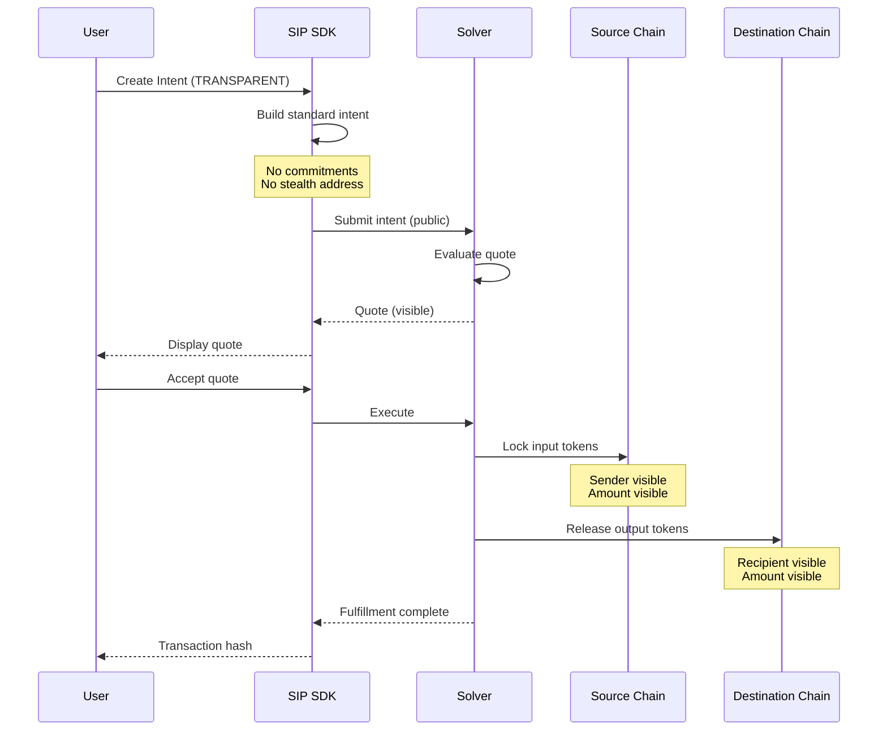

### Shielded Flow

Full privacy with hidden sender, amount, and unlinkable recipient.

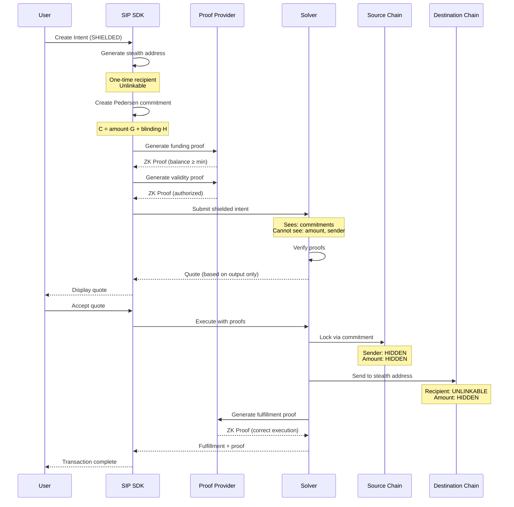

### Compliant Flow

Privacy with selective disclosure via viewing keys.

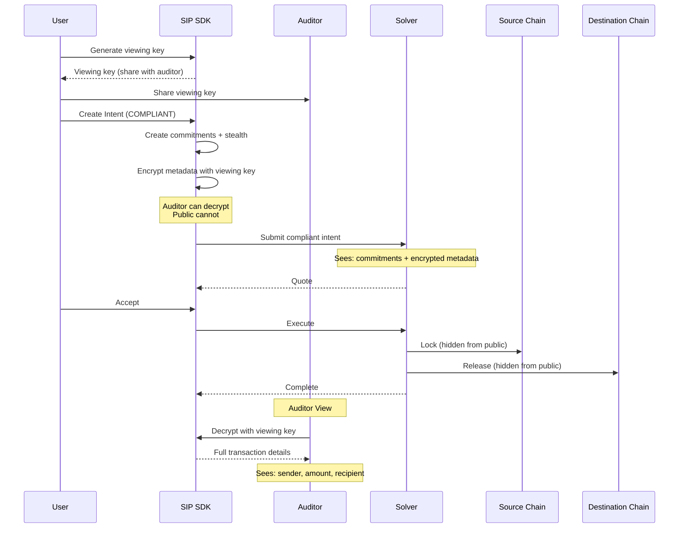

---

## Cryptographic Flows

### Stealth Address Generation

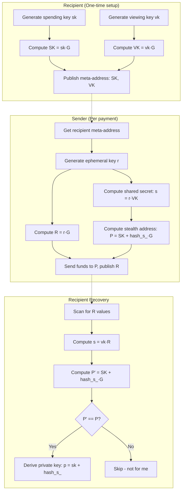

### Pedersen Commitment Scheme

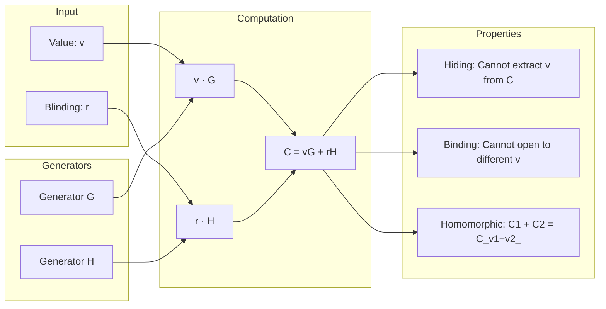

### Proof Generation Pipeline

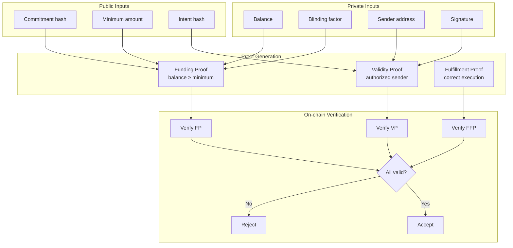

---

## Privacy Comparison

### Before SIP: The ZachXBT Problem

```
┌─────────────────────────────────────────────────────────────────┐
│                    STANDARD CROSS-CHAIN SWAP                     │
├─────────────────────────────────────────────────────────────────┤
│                                                                  │
│   Whale Wallet                         Exchange                  │
│   ┌─────────┐                         ┌─────────┐               │
│   │  0xABC  │ ──── 1000 ETH ────────▶ │  0xDEF  │               │
│   │ $50M+   │                         │ Kraken  │               │
│   └─────────┘                         └─────────┘               │
│       │                                                          │
│       │ 100% VISIBLE:                                           │
│       │ • Sender: 0xABC (known whale)                           │
│       │ • Amount: 1000 ETH ($3.5M)                              │
│       │ • Recipient: 0xDEF (exchange deposit)                   │
│       │ • Time: Block 18234567                                  │
│       ▼                                                          │
│   ┌─────────────────────────────────────────────────────────┐   │
│   │                    BLOCKCHAIN EXPLORER                    │   │
│   │  Anyone can see:                                          │   │
│   │  • Transaction history                                    │   │
│   │  • Balance changes                                        │   │
│   │  • Linked addresses                                       │   │
│   │  • Trading patterns                                       │   │
│   └─────────────────────────────────────────────────────────┘   │
│       │                                                          │
│       ▼                                                          │
│   ┌─────────────────────────────────────────────────────────┐   │
│   │                    ATTACK VECTORS                         │   │
│   │  ❌ Front-running: Bots see large trade incoming          │   │
│   │  ❌ Sandwich attacks: Profit from price impact            │   │
│   │  ❌ Social engineering: Target whale directly             │   │
│   │  ❌ Physical threats: Know wealth location                │   │
│   │  ❌ Tax surveillance: Complete transaction history        │   │
│   └─────────────────────────────────────────────────────────┘   │
│                                                                  │
└─────────────────────────────────────────────────────────────────┘
```

### After SIP: Privacy Preserved

```
┌─────────────────────────────────────────────────────────────────┐
│                    SHIELDED CROSS-CHAIN SWAP                     │
├─────────────────────────────────────────────────────────────────┤
│                                                                  │
│   Whale Wallet                         Stealth Address          │
│   ┌─────────┐                         ┌─────────┐               │
│   │  0xABC  │ ──── C(amount) ───────▶ │  0x???  │               │
│   │ Hidden  │      commitment          │One-time │               │
│   └─────────┘                         └─────────┘               │
│       │                                                          │
│       │ WHAT OBSERVERS SEE:                                     │
│       │ • Sender: Pedersen commitment (random curve point)      │
│       │ • Amount: Pedersen commitment (hidden)                  │
│       │ • Recipient: Fresh stealth address (unlinkable)         │
│       │ • Proof: ZK proof of validity (no secrets revealed)     │
│       ▼                                                          │
│   ┌─────────────────────────────────────────────────────────┐   │
│   │                    BLOCKCHAIN EXPLORER                    │   │
│   │  Observer sees:                                           │   │
│   │  • Commitment: 0x7a3f...9c2d (meaningless)               │   │
│   │  • Proof: Valid ZK proof                                  │   │
│   │  • Recipient: 0xf8e2...1b4a (one-time, unlinkable)       │   │
│   │  • NO connection to whale wallet                          │   │
│   └─────────────────────────────────────────────────────────┘   │
│       │                                                          │
│       ▼                                                          │
│   ┌─────────────────────────────────────────────────────────┐   │
│   │                    PROTECTION PROVIDED                    │   │
│   │  ✅ No front-running: Amount unknown                      │   │
│   │  ✅ No sandwich attacks: Can't predict impact             │   │
│   │  ✅ No targeting: Identity hidden                         │   │
│   │  ✅ No wealth exposure: Balance unknown                   │   │
│   │  ✅ Compliance ready: Viewing key for authorized audit    │   │
│   └─────────────────────────────────────────────────────────┘   │
│                                                                  │
└─────────────────────────────────────────────────────────────────┘
```

### Side-by-Side Comparison

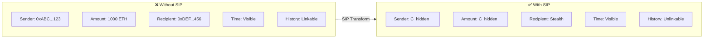

---

## Integration Architecture

### Wallet Adapter Architecture

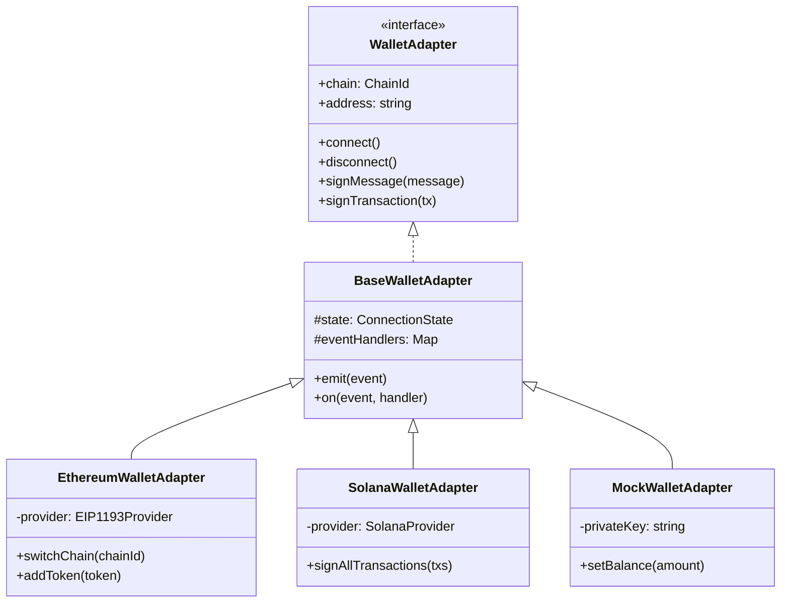

### Network Adapter Architecture

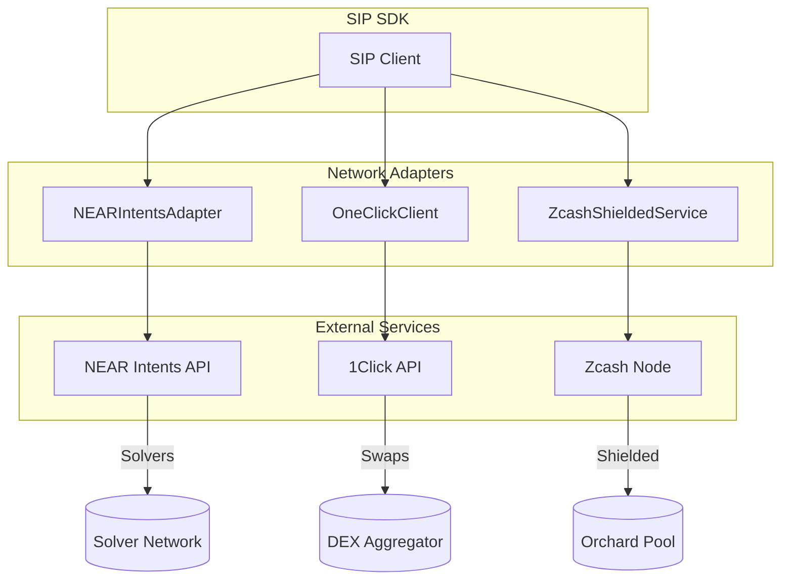

### Complete Integration Flow

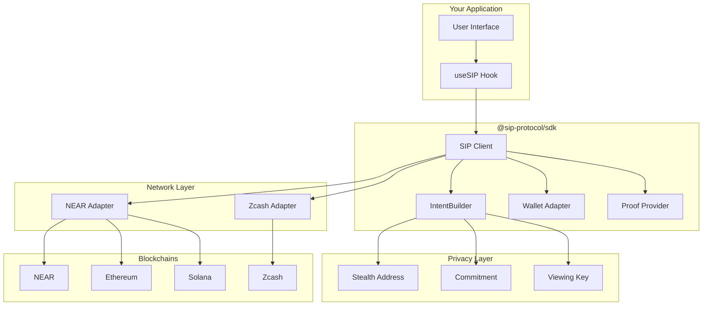

---

## Quick Reference

### Component Responsibilities

| Component | Responsibility |
|-----------|----------------|
| `SIP` | Main client, orchestrates all operations |
| `IntentBuilder` | Fluent API for creating intents |
| `WalletAdapter` | Chain-specific wallet interactions |
| `ProofProvider` | ZK proof generation |
| `NEARIntentsAdapter` | NEAR Intents API integration |
| `ZcashShieldedService` | Zcash shielded transactions |

### Data Flow Summary

```
User Input → IntentBuilder → Privacy Layer → Proofs → Network → Blockchain
                   ↓              ↓           ↓
              Validation    Commitments    Verification
                   ↓              ↓           ↓
              Type Safety   Stealth Addr   Settlement
```

---

*Part of the [SIP Protocol](https://github.com/sip-protocol) ecosystem*
